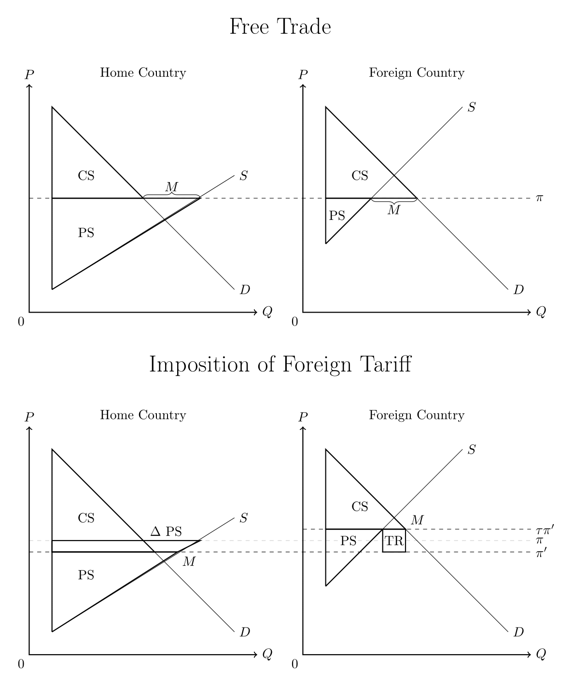
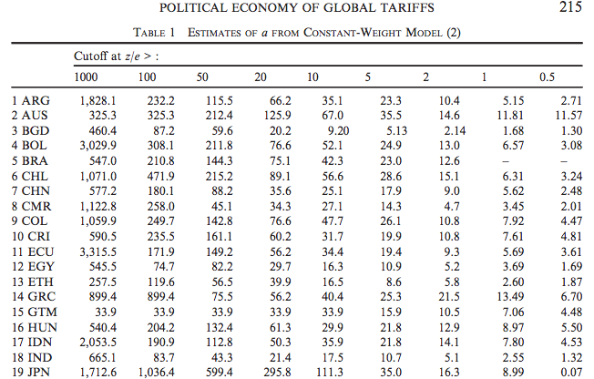

---
title       : Endogenous Protection and International Rivalry
subtitle    : Linking the Domestic Politics of Trade and Interstate Conflict
author      : Brendan Cooley
job         : March 2, 2017
framework   : io2012        # {io2012, html5slides, shower, dzslides, ...}
highlighter : highlight.js  # {highlight.js, prettify, highlight}
hitheme     : tomorrow      # 
widgets     : [mathjax]            # {mathjax, quiz, bootstrap}
mode        : selfcontained # {standalone, draft}
runtime     : shiny
knit        : slidify::knit2slides
--- .class #id

<div style="display:none">
  $
    \newcommand{\argmin}{\text{arg}\,\text{min}  }
    \newcommand{\argmax}{\text{arg}\,\text{max}  }
  $
</div>

## Theorizing International Rivalry

- **Big Picture Question**: Where do international rivalries come from?
  - Motivating historical example: *The Rise of the Anglo-German Antagonism* (Kennedy 1987)
  - Contemporary example: Sino-U.S. relations
- **The Lake (2014) hypothesis**: evolution of U.S.-China relations in 21st century will be determined by character of domestic political economies
  - "If integration strengthens market forces within China, cooperation between the two superpowers will likely be expanded as common interests prevail. If political forces remain dominant in China, greater conflict may emerge."
- Broad definition of conflict: costly signals of various sorts (Fearon 1997)
  - Low end: denouncements/accusations/threats
  - High end: military mobilization/skirmishes/war
- To evaluate the Lake hypothesis, need a coherent theoretical framework linking domestic political regimes and policies, cross-border economic flows, and international bargaining

--- .class #id 

## Trade Policy Preferences and Externalities

- **Rationales for protectionism**:
  - **Classical economic explanation**: Large economies and terms of trade effects
  - **Political economic explanation**: Goverments disproportionately weigh politically-organized producer interests relative to social welfare (Grossman and Helpman 1994, 1995)
- **Externalities of Protection**: imposes costs on both domestic consumers *and foreign exporters in the protected sector*
  - Domestic demand for protection generates conflicts of interest between imperfectly-represtentative governments
  - Grossman and Helpman 1995: "Increased government sensitivity to the concerns of special interests in one country raises the profits of the organized factor owners in that country at the expense of their counterparts abroad"

--- &twocol

## Externalities of Trade Policy

*** =left
</img>

*** =right
- When foreign country has pricing power, increase in tariff pushes international price down
- This causes shift in income in the home country, favoring consumers at the expense of producers
- $\Delta$ PS $=$ loss suffered by producers in the home country as a result of the imposition of the foreign tariff
- How is the government's utility affected by these shifts? Depends on whose interests it represents...

--- .class #id

## Roadmap

1. Develop $N$-country, $K$-sector model of the international economy with domestic lobbying, based on Grossman and Helpman (1995)
2. Estimate model's structural parameters - $a_i$, weight government places on social welfare relative to political contributions
  - Goldberg and Maggi (1999), Mitra, Thomakos and Ulubasoglu (2006), Gawande, Krishna and Olarreaga (2009, 2015), Ossa (2014)
3. Measure implied dyadic conflicts of interest
  - What bilateral trade policy would country $i$ set if it controlled instruments in countries $i$ and $j$?
  - How much does $i$'s utility change from the scenario in which it controls bilateral trade policy to the scenario in which $j$ controls bilateral trade policy?
4. Connect implied conflict of interest to patterns of dyadic conflict, measured with ICEWS event dataset

--- .class #id

## Model Primatives

- Countries $i \in \left\{1,...,N \right\}$, sectors $k \in \left\{1,...,K \right\}$
- Trade policy instrument $\tau_{ik}$ (uniform tariff applying to all goods in sector $k$)
  - $\tau_{ik} = 1$ no barriers to trade
  - $\tau_{ik} > 1$ import tariff
  - $\tau_{ik} < 1$ export subsidy
- International price $\pi_k(\tau_{1k},...,\tau_{Nk})$
- Domestic price $\tau_{ik} \pi_k(\tau_{1k},...,\tau_{Nk})$
- $W_{i}(\vec{\tau_i}, \vec{\pi})$ social welfare derived from producer profits, consumer surplus, and tariff revenue in economy:
$$W_{i}(\vec{\tau_i}, \vec{\pi}) = \sum_k \underbrace{\Pi_{ik}(\tau_{ik}, \pi_k)}_{\text{producer profits}} + \underbrace{r_{i}(\vec{\tau_i}, \vec{\pi})}_{\text{tariff revenue}} + \underbrace{S_{i}(\vec{\tau_i}, \vec{\pi})}_{\text{consumer surplus}}$$

--- .class #id

## Agents' Objectives

- Governments optimize
$$G_i(\vec{\tau_i}, \vec{\pi}) = \sum_{k=1}^K C_{ik}(\vec{\tau_i}, \vec{\pi}) + a_i W_{i}(\vec{\tau_i}, \vec{\pi})$$
- $C_{ik}(\vec{\tau_i}, \vec{\pi})$ political contributions to government $i$ from sector $k$
- Menu auction (Bernheim and Whinston 1986), sectors of relative population size $\alpha_k$ set contribution schedules to maximize $W_{ik}(\vec{\tau_i}, \vec{\pi}) - C_{ik}(\vec{\tau_i}, \vec{\pi})$ where
$$W_{ik}(\vec{\tau_i}, \vec{\pi}) = l_i + \Pi_{ik}(\tau_{ik}, \pi_{ik}) + \alpha_k \left[r_{i}(\vec{\tau_i}, \vec{\pi}) + S_{i}(\vec{\tau_i}, \vec{\pi}) \right]$$
- Domestic game induces governments to maximize weighted sum of producer welfare and social welfare
$$G_i(\vec{\tau_i}, \vec{\pi}) = \sum_{k=1}^K W_{ik}(\vec{\tau_i}, \vec{\pi}) + a_i W_{i}(\vec{\tau_i}, \vec{\pi})$$

--- .class #id

## 'Trade Talks' (Cooperative) Equilibrium

- Nash ('optimal tariffs') are inefficient from the perspective of $N$ governments with objective functions as specified above
  - Principals of reciprocity and nondiscrimination embedded in multilateral trading system allow politically-motivated governments to realize joint gains (Bagwell and Staiger 2001)
- Equilibrium conditions:
  - Joint maximization:
  $$\nabla_{\tau_k} G_i(\vec{\tau_i}, \vec{\pi}) = 0 \quad \forall \text{ } i, k$$
  - Market clearing, net imports = demand - production: 
  $$M_{ik}(\tau_{ik}, \pi_k) = d_{ik}(\tau_{ik}, \pi_k) - X_{ik}(\tau_{ik}, \pi_k)$$
  $$ \sum_i M_{ik}(\tau_{ik}, \pi_k) = 0 \quad \forall \text{ } k$$

--- .class #id

## 'Trade Talks' (Cooperative) Equilibrium
- Equilibrium protection (ruling out export subsidies ($\tau_{ik} < 1$) and normalizing most 'open' country-sector to $\tau_{ik} = 1$):
$$\tau_{ik}^\star - 1 = - \frac{1 - \alpha_{iL}}{a + \alpha_{iL}} \frac{X_{ik}}{\pi_k M_{ik}^\prime}$$
- Population size of owners of specific factors:
$$\alpha_{iL} = \sum_k \alpha_{ik}$$
- Characteristics:
  - Decreasing in weight government places on social welfare ($a \rightarrow \infty$)
  - Increasing in economic size of sector $k$ ($X_{ik}$)
  - Decreasing in population size of owners of specific factors ($\alpha_{L} \rightarrow 1$)

--- .class #id

## Effect of Foreign Tariffs on Home Welfare

- Consider a change in foreign tariffs in sector $k$:
$$\frac{\partial G_i}{\partial \tau_{j \neq i}} = \underbrace{\frac{\partial \pi}{\partial \tau_{j \neq i}}}_{\text{effect of $\tau_{j \neq i}$ on $\pi$}} \left( \underbrace{\frac{\partial \Pi_{i}}{\partial \pi}  + 
\alpha_k \left[\frac{\partial r_i}{\partial \pi} + \frac{ \partial S_{i}}{\partial \pi} \right]}_{\text{effect on producer interests}} + 
a \underbrace{\left[ \frac{\partial \Pi_{i}}{\partial \pi} + \frac{\partial r_i}{\partial \pi} + \frac{ \partial S_{i}}{\partial \pi} \right]}_{\text{effect on consumer interests}} \right)$$
- Limiting Cases
  - $a \rightarrow 0$ (contribution maximizing govt):
  $$\frac{\partial G_i}{\partial \tau_{j \neq i}} = \frac{\partial \pi}{\partial \tau_{j \neq i}} \left( \frac{\partial \Pi_{i}}{\partial \pi} + \alpha_k \left[ \frac{\partial r_i}{\partial \pi} + \frac{ \partial S_{i}}{\partial \pi} \right] \right)$$
  - $a \rightarrow \infty$ (social welfare maximizing govt):
  $$\frac{\partial G_i}{\partial \tau_{j \neq i}} = \frac{\partial \pi}{\partial \tau_{j \neq i}} \left( \frac{\partial \Pi_{i}}{\partial \pi} + \frac{\partial r_i}{\partial \pi} + \frac{ \partial S_{i}}{\partial \pi} \right)$$

--- .class #id

## Bilateral Ideal Points and Conflicts of Interest

- Assumption: governments always adversely effected by increases in foreign tariffs
  $$\frac{\partial G_i}{\partial \tau_{j \neq i}}  < 0 \quad \forall \text{ } i,k$$
  - Might be violated for highly representative governments ($a \rightarrow \infty$), which weigh increase in consumer surplus induced by decrease in international price equivalently to loss in producer surplus
  - When assumption is met, all governments prefer zero tariffs ($\tau = 1$) in all foreign countries (ruling out possibility of export subsidies)
- **Dyadic Ideal Point**: *bilateral* trade policy country $i$ would set if it controlled trade policy instrument in countries $i$ and $j$
- **Conflict of Interest**: difference in $i$'s welfare evaluated at it's own ideal point versus $j$'s ideal point
  - Will follow Eaton, Dekle and Kortum (2007) and Ossa (2014) in calculating welfare changes induced by counterfactual tariff changes

--- .class #id

## Bilateral Ideal Points and Conflicts of Interest

- Optima tariffs for country $i$, constraining country $j$'s tariffs to zero solve:
$$ \vec{\tau_{i}^c} = \argmax_{\vec{\tau_{i}}} \sum_{k=1}^K \Pi_{ik} \left( \tau_{ik}, \pi_k(\tau_{ik},...,1_{jk},..., \tau_{nk}) \right) + a \sum_{k=1}^K W_{ik} \left( \tau_{ik}, \pi_k(\tau_{ik},...,1_{jk},..., \tau_{nk}) \right) $$
- Government $i$'s utility evaluated at its ideal point:
$$\overline{G}_{ij}(\tau_i^c) = \sum_{k=1}^K G_{ik}(\tau_{ik}^c, \pi_k(\tau_{ik}^c,...,1_{jk},..., \tau_{nk}))$$
- Goverment $i$'s utility evaluated at $j$'s ideal point:
$$\underline{G}_{ij}(1_i) = \sum_{k=1}^K G_{ik}(1_{ik}^c, \pi_k(1_{ik}^c,...,\tau_{jk}^c,..., \tau_{nk}))$$
- Magnitude of conflict of interest: $\overline{G}_{ij}(\tau_i^c) - \underline{G}_{ij}(1_i)$

--- .class #id

## Estimation Procedure

- Goal: recover $N$ estimates of $a_i$ from $N \times K$ country-sector level data
- Recall equilibrium protection:
$$\tau_{ik}^\star - 1  = \max \left\{ 1, -\frac{1 - \alpha_{iL}}{a + \alpha_{iL}} \frac{X_{ik}}{\pi_k M_{ik}^\prime} \right\}$$
- Multiplying rhs by total imports $M_{ik} / M_{ik}$ and everything by $1 / \tau_{ik}^\star$ gives relationship in terms of observables and $a_i$:
$$\frac{\tau_{ik}^\star - 1}{\tau_{ik}^\star}  = - \frac{1 - \alpha_{iL}}{a + \alpha_{iL}} \frac{X_{ik}}{M_{ik}} \frac{1}{e_{ik}}$$
- $\tau_{ik}^\star$ - magnitude of protection, $M_{ik}$ - imports, $X_{ik}$ - production, $e_{ik}$ - elasticity of import demand, $\alpha_{iL}$ - number of employees in organized sectors divided by total population

--- .class #id

## Estimation Procedure

- Assume inverse import penetration ratio $X_{ik} / M_{ik}$ measured with error $\eta_{ik} \sim \mathcal{N}(0, \sigma^2)$, giving
$$\frac{\tau_{ik}^\star - 1}{\tau_{ik}^\star}  = - \frac{1 - \alpha_{iL}}{a + \alpha_{iL}} \left( \frac{X_{ik}}{M_{ik}} + \eta_{ik} \right) \frac{1}{e_{ik}}$$
$$ \eta_{ik} = \frac{\tau_{ik}^\star - 1}{\tau_{ik}^\star} \frac{1 - \alpha_{iL}}{a + \alpha_{iL}} e_{ik} + \frac{X_{ik}}{M_{ik}} $$
- Since $\mathbb{E}(\eta_{ik}) = 0$, estimate of $a_i$ solves
$$ \min_{a_i} \sum_k \left( \frac{\tau_{ik}^\star - 1}{\tau_{ik}^\star} \frac{1 - \alpha_{iL}}{a + \alpha_{iL}} e_{ik} + \frac{X_{ik}}{M_{ik}} \right)^2$$

--- .class #id

## Data

- World Bank's Trade, Production, and Protection dataset (Nicita and Olarreaga 2006)
  - Observations at country-sector-year level (28 ISIC 3-digit sectors)
- Estimate model on combined tariff and non-tariff barriers to trade
  $$\tau_{ik} = \tau_{ik}^{tar} + \tau_{ik}^{ntb}$$
- Focus on cross sectional variation, availability of NTB data leaves ~60 countries with sufficient data, spanning 1995-2001
  - All credibly 'large' countries with pricing power included (i.e. U.S., Japan, China, EU, Russia, South Korea, etc)
- Country-sector import demand elasticity estimates and ad-valorem equivalents of NTBs from Kee et al (2008)

--- &vcenter

## Cross-National Patterns of Protection

Click to go to the [Explorer](https://brendancooley.shinyapps.io/tpp-explorer/)

To open on your computer, open an R console and execute:

```r
require(shiny)
runGitHub('tpp-explorer', user='brendancooley')
```

Or go to: https://brendancooley.shinyapps.io/tpp-explorer/

--- &vcenter

## Estimates Highly Sensitive to Outliers

</img>

*from Gawande et al 2015, similar results obtained using estimator derived above*

--- .class #id

## Alternatives to Baseline Model

- **Counterlobbying**: Model interdependencies across sectors and allow industries to condition contributions on effects of tariff increases on prices of intermediate goods
- **Flexible Weights**: More complexity in government's objective function, allow for differential weights on producer surplus, tariff revenue, and consumer surplus
  - Drawback - takes us further away from lobbying microfoundations of model
- **Influence of Labor Orgs**: jointly estimate $a$ and $\alpha_L$ (Mitra, Thomakos and Ulubasoglu (2006)), government's objective depends on social welfare consciousness and percentage of population that is politically organized
- **Others?**

--- .class #id

## Next Steps

1. Modify baseline model to achieve realistic parameter estimates, balancing parsimony against face validity
2. Derive estimator for welfare changes of counterfactual tariff changes
3. Estimate implied dyadic conflicts of interest
4. Separate project: build state space model to estimate latent conflict-propensity from ICEWS inernational dyadic event data
